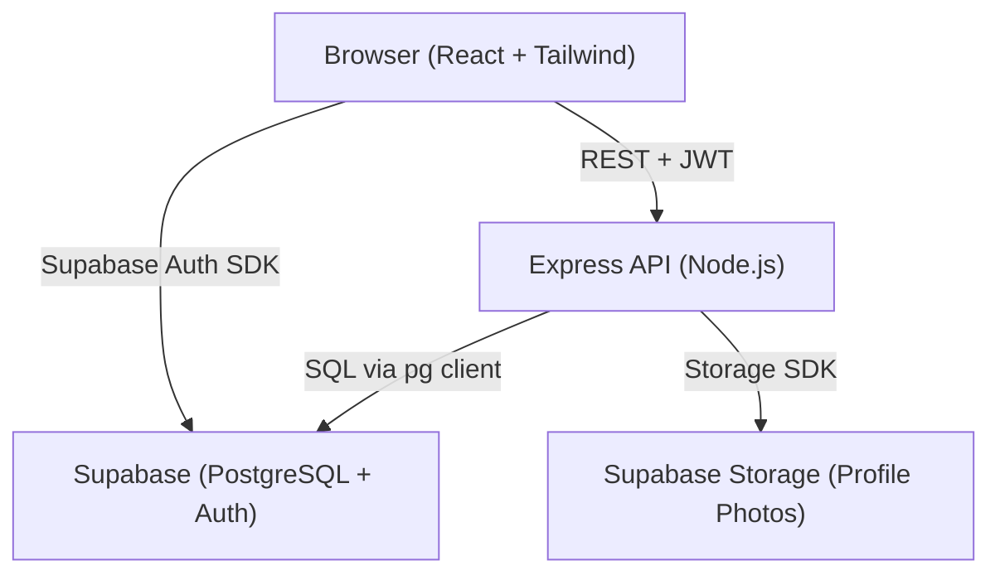
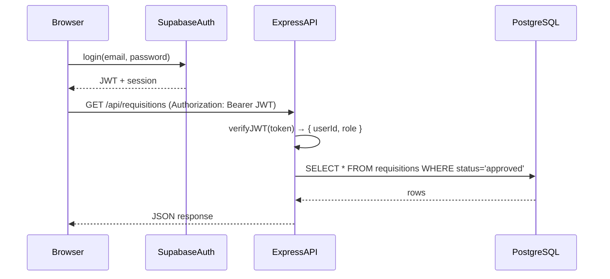

# Design Document: Accretio Platform

## Overview

Accretio is a "Rent a Recruiter" marketplace connecting clients with independent recruiters. The platform supports three user roles (client, recruiter, admin) with role-specific dashboards, a public recruiter directory, requisition lifecycle management, and direct engagement requests. The MVP is a full-stack web application using React + Tailwind CSS, Node.js + Express, PostgreSQL via Supabase, and Supabase Auth.

---

## Architecture



### Layers

- **Frontend (React SPA)**: Single-page application using React Router for client-side routing. Tailwind CSS for styling. React Query (TanStack Query) for server state, caching, and loading/error states. Zustand for lightweight client state (e.g. auth user, modal open/close).
- **Backend (Express API)**: Stateless REST API. JWT middleware validates Supabase-issued tokens on every protected route. Role extracted from JWT claims to enforce RBAC.
- **Database (Supabase/PostgreSQL)**: Relational schema with foreign keys. Row-level security (RLS) policies enforced at the database layer as a secondary defense. Primary enforcement at the API layer.
- **Auth (Supabase Auth)**: Handles registration, login, session tokens. Role stored in `users.role` and also embedded in JWT custom claims via a Supabase database function/trigger.
- **Storage (Supabase Storage)**: Bucket for recruiter profile photos. Signed URLs returned to the API and stored as `photo_url`.

### Request Flow



---

## Components and Interfaces

### Frontend Component Tree

```
App
├── Router
│   ├── PublicLayout
│   │   ├── LandingPage
│   │   ├── RecruiterDirectory (public)
│   │   ├── RecruiterProfilePage (public)
│   │   ├── LoginPage
│   │   └── SignUpPage
│   ├── ClientLayout (protected, role=client)
│   │   └── ClientDashboard
│   │       ├── OverviewCards
│   │       ├── RequisitionsTab
│   │       │   ├── RequisitionForm
│   │       │   ├── RequisitionList
│   │       │   └── RequisitionDetail (applications list)
│   │       └── BrowseRecruitersTab
│   │           ├── RecruiterFilterBar
│   │           ├── RecruiterCard
│   │           └── SendRequestModal
│   ├── RecruiterLayout (protected, role=recruiter)
│   │   └── RecruiterDashboard
│   │       ├── OverviewCards
│   │       ├── MyProfileTab
│   │       │   ├── ProfileEditForm
│   │       │   └── ProfilePreview
│   │       ├── OpenRequisitionsTab
│   │       │   ├── RequisitionFilterBar
│   │       │   ├── RequisitionCard
│   │       │   └── ApplyModal
│   │       ├── MyApplicationsTab
│   │       └── DirectRequestsTab
│   └── AdminLayout (protected, role=admin)
│       └── AdminDashboard
│           ├── OverviewCards
│           ├── RequisitionsTab (admin view)
│           └── UsersTab
│               ├── ClientsTable
│               └── RecruitersTable
└── Shared
    ├── Navbar
    ├── StatusBadge
    ├── SkeletonCard
    ├── ToastProvider
    ├── Modal
    └── EmptyState
```

### Key Shared Components

| Component | Props | Description |
|---|---|---|
| `StatusBadge` | `status: string` | Color-coded badge. Pending=amber, Approved=green, Rejected=red, Closed/Not Selected=gray, Selected=green, Submitted=amber, Reviewed=blue |
| `SkeletonCard` | `count?: number` | Animated placeholder cards during data fetch |
| `EmptyState` | `message: string`, `cta?: ReactNode` | Displayed when a list has no items |
| `Modal` | `isOpen`, `onClose`, `title`, `children` | Reusable modal with backdrop |
| `ToastProvider` | — | Global toast context using `react-hot-toast` or similar |

### API Client (Frontend)

All API calls go through a central `apiClient` module that:
- Attaches the Supabase JWT to every request as `Authorization: Bearer <token>`
- Handles 401 responses by redirecting to login
- Returns typed response objects

### Express Middleware Stack

```
Request
  → cors()
  → express.json()
  → [protected routes] → verifyJWT()  → extractRole()
  → route handler
  → errorHandler()
Response
```

`verifyJWT` middleware:
```typescript
// Pseudocode
function verifyJWT(req, res, next) {
  const token = req.headers.authorization?.split(' ')[1]
  if (!token) return res.status(401).json({ error: 'Unauthorized' })
  const { data, error } = supabaseAdmin.auth.getUser(token)
  if (error) return res.status(401).json({ error: 'Invalid token' })
  req.user = { id: data.user.id, role: data.user.user_metadata.role }
  next()
}
```

---

## Data Models

### Database Schema

```sql
-- Users (mirrors Supabase Auth)
CREATE TABLE users (
  id UUID PRIMARY KEY REFERENCES auth.users(id),
  email TEXT NOT NULL UNIQUE,
  role TEXT NOT NULL CHECK (role IN ('client', 'recruiter', 'admin')),
  created_at TIMESTAMPTZ DEFAULT NOW()
);

-- Client Profiles
CREATE TABLE client_profiles (
  id UUID PRIMARY KEY DEFAULT gen_random_uuid(),
  user_id UUID NOT NULL REFERENCES users(id) ON DELETE CASCADE,
  company_name TEXT,
  industry TEXT,
  location TEXT,
  UNIQUE(user_id)
);

-- Recruiter Profiles
CREATE TABLE recruiter_profiles (
  id UUID PRIMARY KEY DEFAULT gen_random_uuid(),
  user_id UUID NOT NULL REFERENCES users(id) ON DELETE CASCADE,
  full_name TEXT NOT NULL,
  bio TEXT,
  specialties TEXT[],
  experience_years INTEGER,
  industries TEXT[],
  availability_status TEXT NOT NULL DEFAULT 'Available'
    CHECK (availability_status IN ('Available', 'Busy', 'Open to offers')),
  photo_url TEXT,
  UNIQUE(user_id)
);

-- Requisitions
CREATE TABLE requisitions (
  id UUID PRIMARY KEY DEFAULT gen_random_uuid(),
  client_id UUID NOT NULL REFERENCES users(id),
  job_title TEXT NOT NULL,
  department TEXT,
  employment_type TEXT,
  engagement_type TEXT NOT NULL CHECK (engagement_type IN ('Hire', 'Rent')),
  duration TEXT,
  description TEXT NOT NULL,
  person_specification TEXT NOT NULL,
  status TEXT NOT NULL DEFAULT 'pending'
    CHECK (status IN ('pending', 'approved', 'rejected', 'closed')),
  rejection_reason TEXT,
  created_at TIMESTAMPTZ DEFAULT NOW()
);

-- Applications
CREATE TABLE applications (
  id UUID PRIMARY KEY DEFAULT gen_random_uuid(),
  requisition_id UUID NOT NULL REFERENCES requisitions(id),
  recruiter_id UUID NOT NULL REFERENCES users(id),
  cover_note TEXT,
  status TEXT NOT NULL DEFAULT 'submitted'
    CHECK (status IN ('submitted', 'reviewed', 'selected', 'not_selected')),
  created_at TIMESTAMPTZ DEFAULT NOW(),
  UNIQUE(requisition_id, recruiter_id)
);

-- Direct Requests
CREATE TABLE direct_requests (
  id UUID PRIMARY KEY DEFAULT gen_random_uuid(),
  client_id UUID NOT NULL REFERENCES users(id),
  recruiter_id UUID NOT NULL REFERENCES users(id),
  engagement_type TEXT NOT NULL CHECK (engagement_type IN ('Hire', 'Rent')),
  duration TEXT,
  message TEXT,
  status TEXT NOT NULL DEFAULT 'pending'
    CHECK (status IN ('pending', 'accepted', 'declined')),
  created_at TIMESTAMPTZ DEFAULT NOW()
);
```

### TypeScript Interfaces (Frontend + API)

```typescript
type Role = 'client' | 'recruiter' | 'admin'
type RequisitionStatus = 'pending' | 'approved' | 'rejected' | 'closed'
type ApplicationStatus = 'submitted' | 'reviewed' | 'selected' | 'not_selected'
type DirectRequestStatus = 'pending' | 'accepted' | 'declined'
type AvailabilityStatus = 'Available' | 'Busy' | 'Open to offers'
type EngagementType = 'Hire' | 'Rent'

interface User {
  id: string
  email: string
  role: Role
  created_at: string
}

interface RecruiterProfile {
  id: string
  user_id: string
  full_name: string
  bio: string
  specialties: string[]
  experience_years: number
  industries: string[]
  availability_status: AvailabilityStatus
  photo_url: string | null
}

interface Requisition {
  id: string
  client_id: string
  job_title: string
  department: string
  employment_type: string
  engagement_type: EngagementType
  duration: string
  description: string
  person_specification: string
  status: RequisitionStatus
  rejection_reason: string | null
  created_at: string
}

interface Application {
  id: string
  requisition_id: string
  recruiter_id: string
  cover_note: string
  status: ApplicationStatus
  created_at: string
}

interface DirectRequest {
  id: string
  client_id: string
  recruiter_id: string
  engagement_type: EngagementType
  duration: string
  message: string
  status: DirectRequestStatus
  created_at: string
}
```

### API Endpoint Contracts

| Method | Path | Auth | Role | Description |
|---|---|---|---|---|
| POST | `/api/requisitions` | JWT | client | Create requisition |
| GET | `/api/requisitions` | JWT | recruiter | Get approved requisitions |
| GET | `/api/requisitions/:id` | JWT | any | Get single requisition |
| PATCH | `/api/requisitions/:id/status` | JWT | admin | Approve or reject |
| POST | `/api/applications` | JWT | recruiter | Apply to requisition |
| GET | `/api/applications/requisition/:id` | JWT | client | View applications for requisition |
| PATCH | `/api/applications/:id/status` | JWT | client | Accept or decline applicant |
| GET | `/api/recruiters` | public | — | Public recruiter directory |
| GET | `/api/recruiters/:id` | public | — | Single recruiter profile |
| PUT | `/api/recruiters/:id` | JWT | recruiter | Update own profile |
| POST | `/api/requests` | JWT | client | Send direct request |
| GET | `/api/requests/recruiter/:id` | JWT | recruiter | View own direct requests |
| PATCH | `/api/requests/:id/status` | JWT | recruiter | Accept or decline request |

---

## Correctness Properties

*A property is a characteristic or behavior that should hold true across all valid executions of a system — essentially, a formal statement about what the system should do. Properties serve as the bridge between human-readable specifications and machine-verifiable correctness guarantees.*

### Property 1: Role-based redirect after login

*For any* registered user with a valid role (client, recruiter, admin), logging in should always redirect to the dashboard corresponding to that role, never to a dashboard for a different role.

**Validates: Requirements 2.1**

---

### Property 2: Requisition status transitions are valid

*For any* requisition, the status field should only ever hold one of the four valid values: "pending", "approved", "rejected", or "closed". No other value should be persisted or returned by the API.

**Validates: Requirements 7.3, 12.3, 12.5**

---

### Property 3: Only approved requisitions visible to recruiters

*For any* call to `GET /api/requisitions` by an authenticated recruiter, every requisition in the response should have status "approved". No pending, rejected, or closed requisitions should appear.

**Validates: Requirements 10.1**

---

### Property 4: Application uniqueness per recruiter per requisition

*For any* recruiter and any requisition, submitting an application should succeed only once. A second application attempt by the same recruiter to the same requisition should be rejected.

**Validates: Requirements 10.6**

---

### Property 5: Accepting an application marks all others as not_selected

*For any* requisition with multiple applications, when a client accepts one application, all other applications for that same requisition should have their status set to "not_selected".

**Validates: Requirements 7.5**

---

### Property 6: Direct request data isolation

*For any* recruiter, `GET /api/requests/recruiter/:id` should return only direct requests where `recruiter_id` matches the authenticated recruiter's user ID. No other recruiter's requests should appear.

**Validates: Requirements 11.1, 17.3**

---

### Property 7: Client data isolation for requisitions

*For any* client, `GET /api/applications/requisition/:id` should only succeed when the requisition's `client_id` matches the authenticated client's user ID. Requests for another client's requisition should return 403.

**Validates: Requirements 17.2**

---

### Property 8: JWT required on all protected endpoints

*For any* protected API endpoint, a request without a valid JWT should receive a 401 response. This holds regardless of the HTTP method or endpoint path.

**Validates: Requirements 17.1, 2.5**

---

### Property 9: Admin-only endpoints reject non-admin roles

*For any* admin-only endpoint (e.g. `PATCH /api/requisitions/:id/status`), a request authenticated as a client or recruiter should receive a 403 response.

**Validates: Requirements 17.4**

---

### Property 10: Rejection requires a reason

*For any* requisition rejection action, the API should only update the status to "rejected" when a non-empty `rejection_reason` is provided. Requests with a missing or empty reason should be rejected with a 400 response.

**Validates: Requirements 12.4, 12.5**

---

### Property 11: Recruiter profile update round trip

*For any* valid recruiter profile update payload, submitting the update and then fetching the profile should return data equivalent to what was submitted.

**Validates: Requirements 9.1**

---

### Property 12: Application status values are valid

*For any* application record, the status field should only ever hold one of: "submitted", "reviewed", "selected", "not_selected".

**Validates: Requirements 10.7**

---

### Property 13: Direct request status values are valid

*For any* direct_request record, the status field should only ever hold one of: "pending", "accepted", "declined".

**Validates: Requirements 11.3, 11.4**

---

## Error Handling

### Frontend

- All React Query mutations include `onError` callbacks that fire a toast notification
- Form validation uses `react-hook-form` with `zod` schema validation — errors are displayed inline beneath each field
- 401 API responses trigger automatic redirect to `/login` via the `apiClient` interceptor
- 403 API responses display a "Not authorized" toast
- Network errors display a generic "Something went wrong" toast with a retry option

### Backend

- All route handlers are wrapped in try/catch; unhandled errors fall through to the global `errorHandler` middleware
- Validation errors (missing fields, invalid enum values) return 400 with a structured `{ error: string, fields?: Record<string, string> }` body
- Auth errors return 401
- Authorization errors return 403
- Not found errors return 404
- All 5xx errors are logged server-side; the client receives a generic message

### Error Response Shape

```typescript
interface ApiError {
  error: string
  fields?: Record<string, string>  // field-level validation errors
  code?: string                     // machine-readable error code
}
```

---

## Testing Strategy

### Dual Testing Approach

Both unit tests and property-based tests are required. They are complementary:
- **Unit tests** verify specific examples, edge cases, and integration points
- **Property-based tests** verify universal properties across many generated inputs

### Property-Based Testing

- Library: **fast-check** (TypeScript/JavaScript)
- Minimum **100 iterations** per property test
- Each property test is tagged with a comment referencing the design property:
  - Tag format: `// Feature: accretio-platform, Property N: <property_text>`
- Each correctness property (1–13) above maps to exactly one property-based test

### Unit Testing

- Library: **Vitest** (frontend + backend)
- **React Testing Library** for component tests
- Focus on:
  - Specific form validation examples (empty fields, invalid formats)
  - Status badge rendering for each status value
  - Empty state rendering
  - API error handling (mock 401, 403, 500 responses)
  - Role-based redirect logic

### Test Coverage Targets

| Layer | Tool | Focus |
|---|---|---|
| API route handlers | Vitest + Supertest | Auth enforcement, status transitions, data isolation |
| React components | Vitest + RTL | Rendering, form validation, empty states, toasts |
| Data models | fast-check | Property tests 1–13 |
| Integration | Vitest + Supertest | End-to-end API flows per user role |

### Property Test Configuration

```typescript
// Example property test structure
import fc from 'fast-check'
import { describe, it } from 'vitest'

describe('accretio-platform properties', () => {
  it('Property 3: Only approved requisitions visible to recruiters', () => {
    // Feature: accretio-platform, Property 3: only approved requisitions visible to recruiters
    fc.assert(
      fc.property(fc.array(arbitraryRequisition()), (requisitions) => {
        const result = filterForRecruiter(requisitions)
        return result.every(r => r.status === 'approved')
      }),
      { numRuns: 100 }
    )
  })
})
```

---

## Frontend Routing

All routes are managed by React Router v6. Protected routes check for a valid session and redirect to `/login` if unauthenticated. Role-guarded routes additionally check `user.role` and redirect to the appropriate dashboard if the role doesn't match.

| Path | Component | Access | Role(s) |
|---|---|---|---|
| `/` | `LandingPage` | Public | — |
| `/login` | `LoginPage` | Public | — |
| `/signup` | `SignUpPage` | Public | — |
| `/recruiters` | `RecruiterDirectory` | Public | — |
| `/recruiters/:id` | `RecruiterProfilePage` | Public | — |
| `/dashboard` | Redirects to role dashboard | Protected | any |
| `/client` | `ClientDashboard` | Protected | client |
| `/client/requisitions` | `RequisitionsTab` | Protected | client |
| `/client/requisitions/:id` | `RequisitionDetail` | Protected | client |
| `/client/browse` | `BrowseRecruitersTab` | Protected | client |
| `/recruiter` | `RecruiterDashboard` | Protected | recruiter |
| `/recruiter/profile` | `MyProfileTab` | Protected | recruiter |
| `/recruiter/requisitions` | `OpenRequisitionsTab` | Protected | recruiter |
| `/recruiter/applications` | `MyApplicationsTab` | Protected | recruiter |
| `/recruiter/requests` | `DirectRequestsTab` | Protected | recruiter |
| `/admin` | `AdminDashboard` | Protected | admin |
| `/admin/requisitions` | `AdminRequisitionsTab` | Protected | admin |
| `/admin/users` | `AdminUsersTab` | Protected | admin |
| `*` | `NotFoundPage` | Public | — |

`/dashboard` resolves via a `RoleRedirect` component that reads `user.role` from the auth store and issues a `<Navigate>` to the correct base path.

---

## Project Structure

```
accretio-platform/
├── client/                          # React frontend
│   ├── public/
│   ├── src/
│   │   ├── api/
│   │   │   └── apiClient.ts         # Axios instance, JWT injection, 401 interceptor
│   │   ├── components/
│   │   │   ├── shared/
│   │   │   │   ├── Navbar.tsx
│   │   │   │   ├── StatusBadge.tsx
│   │   │   │   ├── SkeletonCard.tsx
│   │   │   │   ├── Modal.tsx
│   │   │   │   ├── EmptyState.tsx
│   │   │   │   └── ToastProvider.tsx
│   │   │   ├── client/
│   │   │   │   ├── OverviewCards.tsx
│   │   │   │   ├── RequisitionForm.tsx
│   │   │   │   ├── RequisitionList.tsx
│   │   │   │   ├── RequisitionDetail.tsx
│   │   │   │   ├── RecruiterFilterBar.tsx
│   │   │   │   ├── RecruiterCard.tsx
│   │   │   │   └── SendRequestModal.tsx
│   │   │   ├── recruiter/
│   │   │   │   ├── OverviewCards.tsx
│   │   │   │   ├── ProfileEditForm.tsx
│   │   │   │   ├── ProfilePreview.tsx
│   │   │   │   ├── RequisitionFilterBar.tsx
│   │   │   │   ├── RequisitionCard.tsx
│   │   │   │   └── ApplyModal.tsx
│   │   │   └── admin/
│   │   │       ├── OverviewCards.tsx
│   │   │       ├── ClientsTable.tsx
│   │   │       └── RecruitersTable.tsx
│   │   ├── pages/
│   │   │   ├── LandingPage.tsx
│   │   │   ├── LoginPage.tsx
│   │   │   ├── SignUpPage.tsx
│   │   │   ├── RecruiterDirectory.tsx
│   │   │   ├── RecruiterProfilePage.tsx
│   │   │   ├── ClientDashboard.tsx
│   │   │   ├── RecruiterDashboard.tsx
│   │   │   ├── AdminDashboard.tsx
│   │   │   └── NotFoundPage.tsx
│   │   ├── hooks/
│   │   │   ├── useRequisitions.ts   # React Query hooks for requisitions
│   │   │   ├── useApplications.ts
│   │   │   ├── useRecruiters.ts
│   │   │   ├── useDirectRequests.ts
│   │   │   └── useAuth.ts           # Wraps Supabase auth + auth store
│   │   ├── store/
│   │   │   ├── authStore.ts         # Zustand auth store
│   │   │   └── uiStore.ts           # Zustand UI store (modals, sidebar)
│   │   ├── router/
│   │   │   ├── AppRouter.tsx        # Route definitions
│   │   │   ├── ProtectedRoute.tsx   # Auth guard
│   │   │   └── RoleRoute.tsx        # Role guard
│   │   ├── types/
│   │   │   └── index.ts             # Shared TypeScript interfaces
│   │   ├── lib/
│   │   │   └── supabaseClient.ts    # Supabase browser client
│   │   ├── App.tsx
│   │   └── main.tsx
│   ├── .env
│   ├── tailwind.config.ts
│   └── vite.config.ts
│
└── server/                          # Express backend
    ├── src/
    │   ├── middleware/
    │   │   ├── verifyJWT.ts
    │   │   ├── requireRole.ts
    │   │   └── errorHandler.ts
    │   ├── routes/
    │   │   ├── requisitions.ts
    │   │   ├── applications.ts
    │   │   ├── recruiters.ts
    │   │   └── requests.ts
    │   ├── lib/
    │   │   └── supabaseAdmin.ts     # Supabase service-role client
    │   ├── types/
    │   │   └── index.ts
    │   └── index.ts                 # Express app entry point
    ├── .env
    └── tsconfig.json
```

---

## Design System

### Color Tokens

| Token | Hex | Usage |
|---|---|---|
| Primary | `#0D1B4B` | Navbar, primary buttons, headings |
| Accent | `#00C853` | CTAs, success states, active badges |
| Supporting | `#00897B` | Secondary actions, links, teal accents |
| Neutral BG | `#F0F4FF` | Page backgrounds, card backgrounds |
| White | `#FFFFFF` | Card surfaces, modals |
| Text Primary | `#111827` | Body text (gray-900) |
| Text Muted | `#6B7280` | Labels, secondary text (gray-500) |

Tailwind config extension:

```typescript
// tailwind.config.ts
theme: {
  extend: {
    colors: {
      primary: '#0D1B4B',
      accent: '#00C853',
      supporting: '#00897B',
      'neutral-bg': '#F0F4FF',
    },
    fontFamily: {
      sans: ['Inter', 'sans-serif'],
    },
  },
}
```

### Typography Scale

| Use | Size | Weight | Class |
|---|---|---|---|
| Page heading | 24–28px | 700 | `text-2xl font-bold` / `text-3xl font-bold` |
| Section heading | 18–20px | 600 | `text-lg font-semibold` |
| Card title | 15–16px | 600 | `text-base font-semibold` |
| Body text | 13–14px | 400 | `text-sm` |
| Labels / meta | 11–12px | 400–500 | `text-xs` / `text-xs font-medium` |

Font: **Inter** loaded via Google Fonts or `@fontsource/inter`.

### Spacing & Shape Tokens

- **Border radius**: Cards and modals use `rounded-xl` (12px) to `rounded-2xl` (16px). Buttons use `rounded-lg` (8px). Badges use `rounded-full`.
- **Card padding**: `p-4` (16px) standard, `p-6` (24px) for detail panels.
- **Gap between cards**: `gap-4` in grids.
- **Shadow**: Cards use `shadow-sm`; modals use `shadow-xl`.

### Component Style Notes

**Buttons**
- Primary: `bg-primary text-white hover:bg-primary/90 rounded-lg px-4 py-2 text-sm font-medium transition-colors`
- Secondary: `border border-primary text-primary hover:bg-primary/5 rounded-lg px-4 py-2 text-sm font-medium transition-colors`
- Ghost: `text-primary hover:bg-primary/5 rounded-lg px-4 py-2 text-sm font-medium transition-colors`
- Accent CTA: `bg-accent text-white hover:bg-accent/90 rounded-lg px-4 py-2 text-sm font-medium transition-colors`

**Cards**: `bg-white rounded-xl shadow-sm p-4 border border-gray-100`

**Badges** (StatusBadge): `rounded-full px-2.5 py-0.5 text-xs font-medium`
- Pending: `bg-amber-100 text-amber-700`
- Approved / Selected: `bg-green-100 text-green-700`
- Rejected / Not Selected: `bg-red-100 text-red-700`
- Closed / Reviewed: `bg-gray-100 text-gray-600`
- Submitted: `bg-blue-100 text-blue-700`

**Modals**: `bg-white rounded-2xl shadow-xl p-6 max-w-lg w-full` with a semi-transparent backdrop (`bg-black/40`).

**Inputs**: `border border-gray-200 rounded-lg px-3 py-2 text-sm focus:outline-none focus:ring-2 focus:ring-primary/30 w-full`

**Skeleton loaders**: Use `react-loading-skeleton` or Tailwind `animate-pulse` with `bg-gray-200 rounded` placeholder blocks matching the shape of the real content.

### Micro-animations & Transitions

- All interactive elements use `transition-colors duration-150` for hover/focus color changes.
- Modals fade in with `transition-opacity duration-200`.
- Skeleton loaders use `animate-pulse` (Tailwind built-in).
- Optimistic UI updates (accept/decline) apply status changes immediately with no additional animation — the badge color change is the visual feedback.
- Avoid heavy animations; keep the UI feeling fast and professional.

---

## State Management

### Zustand Stores

**`authStore.ts`**

```typescript
interface AuthState {
  user: User | null          // null = unauthenticated
  session: Session | null    // Supabase session object
  setUser: (user: User | null) => void
  setSession: (session: Session | null) => void
  clear: () => void          // called on logout
}
```

Populated on app mount via `supabase.auth.getSession()` and kept in sync via `supabase.auth.onAuthStateChange()`.

**`uiStore.ts`**

```typescript
interface UIState {
  sidebarOpen: boolean
  activeModal: string | null   // modal identifier, e.g. 'send-request', 'apply'
  modalData: unknown           // payload passed to the open modal
  openModal: (id: string, data?: unknown) => void
  closeModal: () => void
  toggleSidebar: () => void
}
```

### React Query Patterns

**Query keys** follow a hierarchical convention:

```typescript
const queryKeys = {
  recruiters: {
    all: ['recruiters'] as const,
    detail: (id: string) => ['recruiters', id] as const,
  },
  requisitions: {
    all: ['requisitions'] as const,
    detail: (id: string) => ['requisitions', id] as const,
    applications: (id: string) => ['requisitions', id, 'applications'] as const,
  },
  requests: {
    mine: (recruiterId: string) => ['requests', recruiterId] as const,
  },
}
```

**Mutation patterns**: All mutations use `onSuccess` to invalidate the relevant query key, triggering a background refetch.

```typescript
const applyMutation = useMutation({
  mutationFn: (payload) => apiClient.post('/api/applications', payload),
  onSuccess: () => {
    queryClient.invalidateQueries({ queryKey: queryKeys.requisitions.all })
    toast.success('Application submitted')
  },
  onError: () => toast.error('Failed to submit application'),
})
```

**Optimistic updates** for accept/decline actions (client accepting an application, recruiter accepting a direct request):

```typescript
const acceptMutation = useMutation({
  mutationFn: (id) => apiClient.patch(`/api/applications/${id}/status`, { status: 'selected' }),
  onMutate: async (id) => {
    await queryClient.cancelQueries({ queryKey: queryKeys.requisitions.applications(requisitionId) })
    const previous = queryClient.getQueryData(queryKeys.requisitions.applications(requisitionId))
    queryClient.setQueryData(queryKeys.requisitions.applications(requisitionId), (old) =>
      old.map(a => a.id === id ? { ...a, status: 'selected' } : { ...a, status: 'not_selected' })
    )
    return { previous }
  },
  onError: (_err, _id, context) => {
    queryClient.setQueryData(queryKeys.requisitions.applications(requisitionId), context.previous)
    toast.error('Action failed')
  },
  onSettled: () => {
    queryClient.invalidateQueries({ queryKey: queryKeys.requisitions.applications(requisitionId) })
  },
})
```

---

## Environment Configuration

### Frontend (`client/.env`)

| Variable | Description |
|---|---|
| `VITE_SUPABASE_URL` | Supabase project URL (e.g. `https://xyz.supabase.co`) |
| `VITE_SUPABASE_ANON_KEY` | Supabase anon/public key for browser client |
| `VITE_API_BASE_URL` | Base URL of the Express API (e.g. `https://api.accretio.railway.app`) |

### Backend (`server/.env`)

| Variable | Description |
|---|---|
| `SUPABASE_URL` | Supabase project URL |
| `SUPABASE_SERVICE_ROLE_KEY` | Supabase service-role key (never exposed to browser) |
| `DATABASE_URL` | PostgreSQL connection string (from Supabase → Settings → Database) |
| `PORT` | Port for the Express server (default `3000`) |
| `CORS_ORIGIN` | Allowed origin for CORS (frontend URL) |

---

## Deployment

Both services are deployed as separate Railway projects (or services within one Railway project).

- **Frontend**: Static site build (`vite build`) served via Railway's static hosting or a lightweight Node server. Environment variables (`VITE_*`) injected at build time via Railway's variable settings.
- **Backend**: Node.js service. Railway auto-detects the `package.json` start script. Environment variables injected at runtime via Railway's variable settings.
- **Database**: Supabase manages PostgreSQL. The backend connects via `DATABASE_URL` (connection pooling via Supabase's connection pooler recommended for production).
- **Storage**: Supabase Storage bucket (`recruiter-photos`) created manually in the Supabase dashboard. Bucket policy set to allow authenticated uploads and public reads.

No Docker configuration is required for Railway — Railway builds directly from the repo.

---

## Key Implementation Notes

### Supabase Auth Role in JWT

User role is embedded in the JWT `user_metadata` via a Supabase database trigger that fires on `INSERT` into `auth.users`. The trigger calls a Postgres function that sets `raw_user_meta_data` to include `{ "role": "<role>" }`. This makes the role available in the JWT without an extra DB lookup on every request.

```sql
-- Trigger function (simplified)
CREATE OR REPLACE FUNCTION public.handle_new_user()
RETURNS TRIGGER AS $$
BEGIN
  INSERT INTO public.users (id, email, role)
  VALUES (NEW.id, NEW.email, NEW.raw_user_meta_data->>'role');
  RETURN NEW;
END;
$$ LANGUAGE plpgsql SECURITY DEFINER;

CREATE TRIGGER on_auth_user_created
  AFTER INSERT ON auth.users
  FOR EACH ROW EXECUTE FUNCTION public.handle_new_user();
```

The `role` must be passed as part of `options.data` during `supabase.auth.signUp({ email, password, options: { data: { role } } })`.

### Photo Upload Flow

1. Frontend calls `POST /api/recruiters/:id/photo-upload-url` → backend generates a Supabase Storage presigned upload URL.
2. Frontend uploads the file directly to Supabase Storage using the presigned URL (no file data passes through the Express server).
3. On upload success, frontend calls `PUT /api/recruiters/:id` with `{ photo_url: <public_url> }` to persist the URL.

### Optimistic UI for Accept / Decline

As shown in the State Management section, accept/decline mutations use React Query's `onMutate` to immediately update the local cache before the server responds. If the server returns an error, `onError` rolls back to the previous cache snapshot. This gives instant visual feedback without waiting for the network round-trip.

### Skeleton Loaders

Use `react-loading-skeleton` for structured skeletons that match the shape of real content (e.g. a skeleton card with a circle for the avatar and two lines for name/bio). For simpler cases, Tailwind's `animate-pulse` with `bg-gray-200 rounded` divs is sufficient. Skeletons are shown while React Query's `isLoading` is `true` on initial fetch (not on background refetches).

### Toast Notifications

`react-hot-toast` is used globally. `<Toaster>` is mounted once at the root in `App.tsx`. All mutations call `toast.success(...)` or `toast.error(...)` in their `onSuccess`/`onError` callbacks. The `apiClient` interceptor fires `toast.error('Session expired')` and redirects to `/login` on 401 responses.
